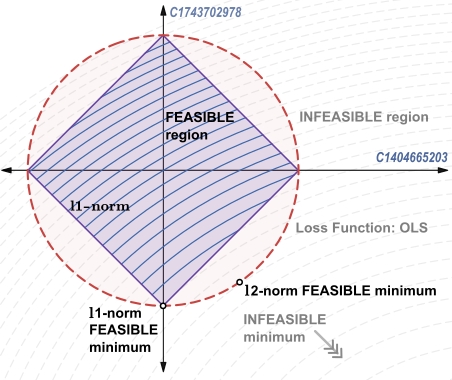

# Fraudulent Transaction Detection Using Machine Learning - Group-LASSO Coefficient Based Feature Grouping

This project focuses on developing an effective classification model to detect fraudulent transactions within a banking dataset. Two main challenges are addressed:

1. **High-Dimensional Categorical Data**: Handling categorical variables with numerous subcategories, which can lead to overfitting and increased computational complexity.

2. **Highly Unbalanced Data**: Managing class imbalance, which can cause bias toward the majority class and hinder the detection of minority class instances.

By implementing strategic dimensionality reduction techniques and testing various machine learning models, this project achieves improved accuracy and efficiency in fraud detection.

## Dataset
This project uses a synthetic dataset generated by the BankSim payment simulator. It can be found at the following link: [Kaggle](https://www.kaggle.com/datasets/ealaxi/banksim1/data?select=bsNET140513_032310.csv).

## Project Overview

- **Objective**: To build a robust and accurate classification model that identifies fraudulent transactions in a banking dataset.

- **Dataset Characteristics**:

  There are two classes in the dataset:
  - **Class 0**: Non-fraudulent transactions (count: 587,443)
  - **Class 1**: Fraudulent transactions (count: 7,200)
  - **Total count**: 594,643
  - **'Class 1' to 'Class 0' ratio**: 1.22565%

  Five categorical variables:
  - **customer (ID)**: 4,112 subcategories
  - **merchant**: 50 subcategories
  - **category**: 15 subcategories    
  - **age**: 8 subcategories
  - **gender**: 4 subcategories

  Two numerical variables:
  - **amount**
  - **day** (referred to as `step` in the dataset): 180 days. Integer values range from 0 to 179; it's not clear which days of the year they represent.

## Approach

### Machine Learning Algorithms:

In this project, a variety of machine learning models were employed to tackle the classification problem. Each model has its strengths, and they were chosen to explore different aspects of performance and robustness. Below is a brief explanation of each:

- **Logistic Ridge Regression**:  
  Logistic Ridge Regression is an extension of logistic regression that adds a regularization term to penalize large coefficients. This helps prevent overfitting, especially when dealing with high-dimensional data. By controlling the complexity of the model through the regularization parameter, it strikes a balance between fitting the data well and maintaining generalization to unseen examples.

- **Support Vector Machine (SVM)**:  
  SVM is a robust classification algorithm that works by finding the optimal hyperplane that separates data points of different classes with the largest possible margin. It can handle both linear and nonlinear boundaries by using kernel functions to map data into higher dimensions, making it suitable for complex classification tasks.

- **XGBoost**:  
  XGBoost is a powerful gradient boosting framework designed for speed and performance. It builds an ensemble of decision trees, where each tree corrects the errors of the previous ones, making it highly effective for classification tasks. XGBoost also includes features like regularization, handling missing data, and parallelization, making it well-suited for large datasets and complex problems.

### Data Imbalance

Data imbalance is a significant challenge in machine learning, particularly in fraud detection, where the majority of transactions are legitimate and only a small fraction are fraudulent. This imbalance can severely impact a model’s ability to learn the minority class (fraud), as the model may be biased toward the majority class.

The issue with imbalanced data is not just the overwhelming presence of the majority class but the insufficient representation of the minority class, which prevents the classifier from effectively learning its characteristics. Moreover, within-class imbalance can occur when small subgroups within the minority class are underrepresented, leading to poor model performance on specific subsets of fraudulent transactions. This phenomenon is often referred to as **small disjuncts** [[1]](#ref-1).

For this project, the primary focus was on training classifiers on the unbalanced data without altering the class distribution. However, for comparison, class balancing techniques were experimented with after feature selection, specifically using random undersampling of the majority class. This assumes that the minority class (fraudulent transactions) is sufficiently representative of its population.

### Evaluation Metrics for Imbalanced Data

When dealing with imbalanced datasets, traditional metrics like overall accuracy can be misleading. In highly imbalanced scenarios, a model may achieve high accuracy by simply predicting the majority class most of the time while failing to correctly classify the minority class, which is often the most important in fraud detection tasks. To address this, the following metrics were used:

- **F1 Score**:  
  The F1 score is the harmonic mean of precision and recall, providing a balanced measure that considers both false positives (FP) and false negatives (FN). It is particularly useful in imbalanced datasets because it penalizes models that favor the majority class at the expense of the minority class. The F1 score helps balance the trade-off between detecting fraudulent transactions (minority class) and avoiding false alarms (majority class).

$$ F1 = 2 \times \frac{\text{Precision} \times \text{Recall}}{\text{Precision} + \text{Recall}} $$

- **Recall**:  
  Recall measures the proportion of actual positive instances (fraudulent transactions) that were correctly identified by the model. In fraud detection, missing a fraud case (FN) can be costlier than wrongly flagging a legitimate transaction (FP), so recall is crucial to ensure the model identifies as many fraudulent transactions as possible.

$$ \text{Recall} = \frac{\text{True Positives}}{\text{True Positives} + \text{False Negatives}} $$

- **Recall Macro**:  
  This is the average recall across all classes, treating each class equally, regardless of its size. In the case of imbalanced data, macro recall ensures that the model’s performance on the minority class is given the same importance as its performance on the majority class. This prevents the model from focusing solely on the majority class and ignoring the minority class.

$$ \text{Recall Macro} = \frac{\text{1}}{N} \sum_{i=1}^{N} \text{Recall}_i $$

  where \(N\) is the number of classes.

- **PR-AUC (Precision-Recall Area Under the Curve)**:  
  The PR-AUC summarizes the trade-off between precision and recall across different thresholds, providing an overall measure of a model's ability to distinguish between classes. It is more informative than ROC-AUC in imbalanced datasets because it focuses on the minority class and avoids inflating performance based on the majority class. A higher PR-AUC means better precision and recall balance, which is vital for detecting fraud.

  PR-AUC was the primary metric used to evaluate the models' performance, as it captures the trade-off between precision and recall across various thresholds. This flexibility is crucial because false negatives can be costly, and adjusting the threshold allows the model to balance the sensitivity to fraudulent transactions with minimizing false positives. By evaluating performance across all thresholds, PR-AUC ensures that the model remains effective even when the decision threshold needs to be adjusted.

#### Why Not Use Overall Accuracy?

In imbalanced datasets, overall accuracy can give a false sense of model performance. For instance, if 98% of transactions are legitimate and only 2% are fraudulent, a model that always predicts "legitimate" will achieve 98% accuracy, despite never detecting fraud. Metrics like F1 score, recall, recall macro, and PR-AUC focus on the performance of the minority class, ensuring that the model’s ability to identify fraud is not overshadowed by the majority class.

#### **Optimal Threshold Selection**

To determine the most effective decision threshold for the classification model, a comprehensive evaluation was conducted by plotting Recall against F1 Score across multiple threshold values. The process involved:

- **Recall vs. F1 Score Plotting:**  
  For each threshold value, both Recall and F1 Score were calculated and plotted to visualize their relationship.

- **Intersection Point Identification:**  
  The optimal threshold was selected at the intersection of the Recall and F1 Score curves. This intersection point represents the threshold where the balance between FP and FN is optimal, ensuring that the number of FP and FN are closest to each other.

Choosing the threshold at this intersection minimizes the disparity between FP and FN, providing a balanced trade-off between the model's sensitivity (Recall) and precision (F1 Score). This approach ensures that the model does not disproportionately favor either metric.

- **Hypothetical Scenario: High Cost of Missing Fraudulent Transactions**
  
  In real-world applications, the cost of missing fraudulent transactions can be prohibitively high, while the cost of falsely flagging legitimate transactions as fraudulent are usually less costly. I implemented a hypothetical scenario to evaluate the model's performance under stringent constraints:

  - **Hypothetical Constraint:**  
    I set a maximum limit of **10 fraudulent transactions** that can be missed. This was achieved by:
    - **Evaluating Multiple Thresholds:** Calculated FP and FN across **1,000 decision thresholds**.
    - **Identifying Suitable Thresholds:** Identified thresholds where the number of FN was **less than or equal to 10**.
    - **Reporting FP at Optimal Threshold:** For these thresholds, recorded the corresponding number of FP to assess the trade-off.

  This scenario assumes that missing fraudulent transactions is extremely costly, thereby prioritizing Recall to ensure that as few frauds as possible are overlooked. By doing so, it allows us to:
    - **Assess Model Flexibility:** Determine whether the selected optimal model, based on the balance between FP and FN at the intersection point, remains effective under more stringent conditions.
    - **Evaluate Practical Applicability:** Ensure that the model can perform reliably even when operational constraints demand minimal tolerance for missed frauds.

  This approach provides a deeper understanding of the model's robustness and its ability to maintain performance across different operational scenarios, especially those with high stakes.

### Dimensionality Reduction

- **The Curse of Dimensionality**: In high-dimensional datasets, the number of training samples required increases exponentially with dimensionality, a phenomenon known as the "curse of dimensionality." With many dimensions, the data often becomes sparse, leading to estimated coefficients that do not accurately represent the true population.

  Below, Figure 1 shows the count per subcategory of the three largest categorical variables in terms of the number of dimensions.

  

  

  

 <em>Figure 1: Count per subcategory for the three largest categorical variables</em> 

We observe that `merchant` and `category` have mostly sparse dimensions, while `customer` appears to have a better distribution. However, because it has many more subcategories compared to `merchant` and `category`, it still has a significant number of sparse dimensions. The table below shows customers with the 50 least occurances in the dataset, each customer ID is considered a dimension. These sparse dimensions cause the model to overfit to the training data, leading to poor performance on the test data.

  

To mitigate this issue, two approaches were employed:

#### 1) Ridge Regression ($l_2$ Regularization)

Ridge regression introduces a regularization term to the loss function, penalizing large coefficients and helping to prevent overfitting. The optimization problem is formulated as:

 $\text{argmin}_{\mathbf{\beta}} \left( L(\mathbf{\beta}, \mathbf{X}, \mathbf{y}) + \lambda\left|\beta\right|_2^2\right)$ 
  

Where:
- $$L$$ is the loss function (e.g., mean squared error),
- $$\left|\beta\right|_2^2$$ is the $$l_2$$ norm of the coefficients,
- $$\lambda$$ is a tuning parameter controlling the degree of regularization.

The intuition behind this regularization is that it constrains the model's search for optimal coefficients. Without regularization, the optimal solution is likely to result in large coefficients, which can lead to overfitting, especially in sparse dimensions. By imposing the $$l_2$$ norm, we effectively shrink these coefficients, ensuring that the model generalizes better.

Below, Figure 2 illustrates this concept. The $$x$$ and $$y$$ axes represent two dimensions (e.g., 'C1743702978' and 'C1404665203'), with ellipses representing the objective function's contour lines. The circle represents the $$l_2$$ norm constraint. The optimal solution is where the contour lines and the circle intersect. If the circle were larger (weaker regularization), the solution would be closer to the unconstrained solution. Conversely, a smaller circle (stronger regularization) would result in smaller estimated coefficients.

  
    

 <em>Figure 2: Ridge Regression Illustration</em> 

- **Tuning the Regularization Parameter**: The strength of the regularization is controlled by $$\lambda$$. As $$\lambda$$ increases, the size of the $$l_2$$ norm constraint (the circle) shrinks, which reduces the coefficients. The model's performance is evaluated on a separate validation set for different values of $$\lambda$$, and the optimal $$\lambda$$ is selected based on the best validation performance.

The key idea is that the $$l_2$$ norm compensates for the lack of sufficient data by constraining the model’s complexity. This prevents overfitting to sparse dimensions and helps the model generalize better to new data.

While ridge regression can compensate for the lack of information in some of the higher dimensions, it is not a feature selection tool, and it will, for the most part, produce non-zero estimated coefficients.

#### 2) Group LASSO (Group-wise $$l_1$$ Regularization)

Group LASSO is a variant of LASSO regression that applies $$l_1$$ regularization across predefined groups of variables. This method is particularly useful when variables belong to meaningful groups, such as categories or subcategories. Group LASSO encourages sparsity between the groups, shrinking the coefficients of some groups to zero while leaving others intact. Additionally, $$l_1$$ regularization can also be applied within each group, promoting sparsity within them.

Group LASSO mitigates the curse of dimensionality by introducing sparsity among the groups, reducing the effective number of dimensions. Variables or groups with small or zero coefficients are effectively removed from the model, leading to a simpler, more interpretable solution.

The optimization problem for Group LASSO is similar to that of LASSO regression but adds a group structure to the variables. The formulation is as follows:

$\text{argmin}_{\mathbf{\beta}} \left(L(\mathbf{\beta}, \mathbf{X}, \mathbf{y}) + \lambda_1 \left|\mathbf{\beta}\right|_1 + \lambda_2 \sum \left|\beta_{group}\right|_2\right)$

Where:
- $$L$$ is the loss function (e.g., mean squared error),
- $$\left|\beta\right|_1$$ is the $$l_1$$ norm applied to the coefficients within each group,
- $$\left|\beta_{group}\right|_2$$ is the $$l_2$$ norm of the coefficients within each group,
- $$\lambda_1$$ controls the sparsity of the coefficients within each group,
- $$\lambda_2$$ controls the sparsity between groups.

The $l_2$ norm within each group shrinks the coefficients but does not lead to sparsity between the groups. If we unpack the second term in the formula above, each group can be treated as a whole unit, essentially acting as $l_1$ norm between the groups, and as a result promotes group sparsity, as you can see below
     

$\lambda_2 \left(\displaystyle\sqrt{\mathbf{\beta}_{a_1}^2 + \dots + \beta_{a_m}^2} + \displaystyle\sqrt{\mathbf{\beta}_{b_1}^2 + \dots + \beta_{b_n}^2} + \dots + \displaystyle\sqrt{\mathbf{\beta}_{z_1}^2+ \dots + \beta_{z_k}^2}\right)$

          
Where $a, b, \dots, z$ are group labels, and $m, n, \dots, k$ are the number of subcategories within each group.

To illustrate how the $$l_1$$ norm promotes sparsity, Figure 3 below shows the $$l_1$$ norm with $$l_2$$ superimposed on it. With exactly the same tuning parameter for both norms, the geometry of the $$l_1$$ norm allows it to drive one of the estimated coefficients to zero, while the $$l_2$$ still has its optimal solution somewhat in the same relative position compared to Figure 2, even though the tuning parameter was chosen to be stronger in this example.

  
    

 <em>Figure 3: LASSO Illustration</em> 

To experiment with different tuning parameters and see how they change the optimal solution, <a href="https://www.desmos.com/calculator/7lm3ximw06" target="_blank">click here</a> to view the graph created with Desmos.

**LASSO-Coefficients-Based Grouping**: The way LASSO was employed to reduce the dimensions is somewhat unconventional. Group LASSO was used with a small level of regularization among the groups ($$\lambda_2$$). A small amount of $$l_1$$ regularization among subgroups ($$\lambda_1$$) was also applied. The LASSO coefficients were then obtained, and for each group, the coefficients of the subgroups were sorted. Subgroups were then grouped based on the similarity between the coefficients.

Figure 4 below shows paths of the LASSO coefficients. Notice how the optimal $$\lambda_2$$ is very small and did not contribute significantly to the regularization. The model still benefited from the $$l_2$$ regularization among subgroups as discussed earlier.

 <em>Figure 4: Logistic Regression Group LASSO Coefficient Paths</em> 

The groups were determined based on visually inspecting the sorted coefficients (shown in Figure 5 below) and identifying breakpoints.

**The breakpoints chosen were as follows:**

- **`customer`**: 0.01, 0.02, 0.0275, 0.97, 0.99 - total **6 groups**
- **`merchant`**: 0.03, 0.07, 0.17, 0.3, 0.375, 0.6, 0.9 - total **8 groups**
- **`category`**: 0.1, 0.4, 0.6, 0.9, 0.96 - total **6 groups**

Reducing `customer`, `merchant`, and `category` from 4,112, 50, and 15 subcategories to 6, 8, and 6 groups, respectively.

 <em>Figure 5: Sorted LASSO Coefficients for the Larger Categorical Variables with Percentiles to Determine Breakpoints</em> 

**Amount-Spent-Per-Category-Based Grouping**: This method of grouping was used because it made the most sense when it comes to grouping categorical variables based on a common measure. For each category, the total amount spent per customer per subcategory was calculated, sorted based on that amount, and then divided into 8 quantiles. This reduced `customer`, `merchant`, and `category` from 4,112, 50, and 15 subcategories to 8 groups each, respectively.

### Feature Engineering

In addition to dimensionality reduction techniques, new features were engineered to enhance the predictive power of the models. These features were designed to capture additional patterns and relationships within the data that could improve the detection of fraudulent transactions.

The new features added are:

- **Fraud Ratio per Customer**:  
  The proportion of fraudulent transactions associated with each customer.

- **Total Amount per Customer**:  
  The cumulative monetary amount of transactions made by each customer.
  
- **Total Amount per Merchant**:  
  The total amount of money received by each merchant.
  
- **Total Amount per Category**:  
  The total amount spent in each transaction category.
  
- **Total Transactions per Customer**:  
  The total number of transactions made by each customer.
  
### Models Tested

Ten different feature configurations were tested. For each configuration, we applied the three machine learning algorithms described earlier—Logistic Ridge Regression, SVM, and XGBoost—to evaluate how different feature engineering strategies and data balancing techniques affect the performance of each algorithm.

The models are as follows:

1. **Baseline Model**: All original variables.
2. **Reduced Training Data**: All original variables trained on 10% of the data.
3. **Without `Customer` Variable**: All original variables with `customer` removed.
4. **Without Key Categorical Variables**: All original variables with `customer`, `merchant`, and `category` removed.
5. **Grouped by Amount Spent**: `customer`, `merchant`, and `category` grouped based on amount spent per category.
6. **Grouped by LASSO Coefficients**: `customer`, `merchant`, and `category` grouped based on LASSO coefficients.
7. **Feature Engineering Applied**: Same as model 6, with additional new features added. `step`, `age`, and `gender` removed.
8. **Feature Engineering with Reduced Data**: Same as model 7, trained on 10% of the data.
9. **Slight Reduction of Class 0**: Same as model 7, with Class 0 in the training set slightly reduced ('Class 1' to 'Class 0' ratio increased from 1.22565% to 2.04039%)
10. **Balanced Classes**: Same as model 7, with Class 0 in the training set balanced with Class 1.

By testing these models with each algorithm, we aimed to:

- **Evaluate Feature Engineering Impact**: Understand how grouping and feature selection affect model accuracy and computational efficiency across different algorithms.
- **Analyze Basic Class Imbalance Strategies**: Compare the effects of basic class balancing techniques on model performance for each algorithm.
- **Assess Algorithm Performance**: Determine which algorithms perform best under different feature configurations and data balances.

For reference:

- Original Variables: `customer`, `merchant`, `category`, `step`, `age`, `gender`
- New Variables: `fraud ratio per customer`, `amount per customer`, `amount per merchant`, `amount per category`, `total trans. per customer`
 

### Results and Discussion

The results of this project highlight the effectiveness of the proposed dimensionality reduction and feature engineering strategies in improving fraud detection models. Figure 6 illustrates the evaluation metrics for all the models used. Below are the key findings:

- **Dimensionality Reduction Enhances Performance**:  
  The dimensionality reduction strategy, particularly grouping key categorical variables based on LASSO coefficients, significantly enhanced model accuracy and reduced computational load. This method preserved important information while simplifying the feature space, leading to models that are both efficient and effective.

- **Algorithm Performance**:
  - **XGBoost and Logistic Ridge Regression**:  
    Both algorithms handled the high dimensionality of the data very well. XGBoost, in particular, showed strong performance across various models, demonstrating robustness to different feature configurations and class balances.
  - **SVM**:  
    SVM was computationally expensive and struggled with the high dimensionality, making it less practical for this dataset. However, when dimensionality was reduced, SVM's performance improved significantly.

- **Grouping Categorical Variables**:
  - **Amount-Spent-Based Grouping**:  
    Grouping key categorical variables (`customer`, `merchant`, `category`) based on the amount spent per category led to a significant reduction in model performance compared to the baseline. This suggests that important information was lost during this grouping, indicating that spending amounts may not be the most effective criterion for grouping these variables.
  - **LASSO Coefficient-Based Grouping**:  
    Grouping based on LASSO coefficients maintained performance comparable to the baseline while significantly reducing computational overhead. This method effectively identified and preserved the most informative subcategories within the categorical variables.

- **Impact of Additional Features**:
  - **Keeping `step`, `age`, and `gender`**:  
    Keeping these features slightly reduced the performance of the models. This may be due to these variables introducing noise or not being strongly correlated with fraudulent activity in this dataset.
  - **Adding Engineered Features**:  
    Incorporating the newly engineered features along with LASSO grouping significantly improved the performance of XGBoost and SVM compared to the baseline. This enhancement did not have a noticeable effect on the Logistic Ridge Regression model, suggesting that these algorithms may benefit more from the additional information provided by the new features.

- **Class Balancing Techniques**:
  - **Random Downsampling of Class 0**:  
    Balancing the classes by randomly downsampling the majority class (Class 0) significantly reduced the performance of SVM and Logistic Ridge Regression models. This reduction in data may have led to loss of important information necessary for these models to perform well.
  - **XGBoost's Robustness to Class Imbalance**:  
    XGBoost handled the class balancing quite well, maintaining reasonable performance despite the reduced data from Class 0. However, there was still a reduction in performance relative to the baseline, indicating that preserving the original class distribution may be more beneficial for this algorithm.

#### **Results of the Hypothetical Scenario**

The results of the hypothetical scenario are illustrated in Figure 7. The findings are as follows:

- **XGBoost Outperforms SVM and Ridge Regression**:  
  Across all 10 models tested, XGBoost consistently resulted in the lowest number of Class 0 misclassifications (FP). This superior performance underscores XGBoost's robustness and effectiveness in handling complex classification tasks even under strict constraints.

- **Ridge Regression Performance**:  
  Ridge Regression showed slight underperformance in the baseline model compared to XGBoost. However, when key categorical variables were grouped based on LASSO coefficients, Ridge Regression's performance improved marginally. Despite this improvement, when new features were introduced and variables such as `step`, `age`, and `gender` were removed, XGBoost significantly outperformed Ridge Regression, highlighting the former's adaptability to feature engineering enhancements.

- **SVM Performance**:  
  SVM performed poorly across all 10 models in the hypothetical scenario, consistently exhibiting over 100,000 false positives. This indicates that SVM struggles to maintain low FP rates when FN is tightly controlled, making it less suitable for high-stakes fraud detection tasks where minimizing missed frauds is critical.

  

  

  

  

 <em>Figure 6: Evaluation metrics for the tested models</em> 

 

  

 <em>Figure 7: Class 0 (Majority Class) missclassification for a hypothetical scenario where no more than 10 Class 1 misclassifications were allowed by varying the decision threshold of the best performing models</em> 

## Conclusion

This project highlights the importance of careful dimensionality reduction and feature engineering in enhancing model performance for fraud detection tasks. Through strategic use of these techniques, we achieved improved efficiency and accuracy. Key findings include:

- **Effectiveness of XGBoost**: Among the models tested, XGBoost consistently showed superior performance, proving robust across different thresholds and performing well even with limited training data. This reliability makes it a strong choice for fraud detection scenarios.

- **Efficient Dimensionality Reduction**: Grouping categorical variables based on LASSO coefficients enabled effective dimensionality reduction. This approach maintained critical information while reducing computational load, making the model both faster and more efficient.

- **Enhanced Generalization through L2 Regularization**: Applying L2 regularization helped control overfitting in high-dimensional spaces, further improving the model’s ability to generalize to new data.

Overall, this project demonstrates that thoughtful dimensionality reduction and feature engineering, paired with the right algorithm choices, are key to achieving high performance in high dimensional datasets.

## Future Work

Building on the successes and limitations of this project, future research could explore:

1. **Tiered Classification of Fraud Cases**:

   Considering that fraudulent transactions vary in cost and impact, future work could involve categorizing fraud cases into tiers (e.g., low, medium, high severity). Transforming the problem into a multiclass classification task would allow models to prioritize more severe frauds. This approach may require additional data to ensure sufficient representation in each tier and avoid increased sparsity.

2. **Advanced Class Balancing Techniques**:

   Experimenting with sophisticated balancing methods that preserve class information could enhance model performance. Techniques such as:

   - **Synthetic Minority Over-sampling Technique (SMOTE)**: Generates synthetic samples of the minority class to balance the dataset without losing information.
   - **Adaptive Synthetic Sampling (ADASYN)**: Focuses on generating synthetic data for minority class samples that are harder to learn.

3. **Enhanced Feature Engineering**:

   Further investigation into feature selection and creation could uncover additional predictive variables. Methods like mutual information analysis or recursive feature elimination might help identify the most informative features.

4. **Hyperparameter Optimization and Cross-Validation**:

   Due to the large size of the dataset and the associated computational and time constraints, hyperparameter tuning and cross-validation were not conducted in this project. However, following dimensionality reduction, future work could utilize advanced hyperparameter tuning methods, such as Bayesian optimization or randomized search with cross-validation, to fine-tune model parameters and further enhance performance.

---

## APPENDIX - DIAGNOSTIC PLOTS AND CONFUSION MATRICES FOR THE TOP MODELS

 

## Ridge Regression - Model (7):

  

  
  

 

## SVM - Model (7):

  

  
  

## XGBoost - Model (7):

  

  
  

## References

[1] <a href="https://link.springer.com/chapter/10.1007/978-3-540-28645-5_30" target="_blank">Prati, Ronaldo C., Gustavo E. A. P. A. Batista, and Maria Carolina Monard. “Learning with Class Skews and Small Disjuncts.” Lecture Notes in Computer Science (2004): 296–306. Web.</a>

## Project Structure:

[Main Notebook](main.ipynb)

[Used Packages](used_packages.py)

[Data](data)

[Classification Models](models.py)

[Utility Functions](utils.py)

## Author:

Ali Moughnieh: [\@amoughnieh](https://github.com/amoughnieh)
